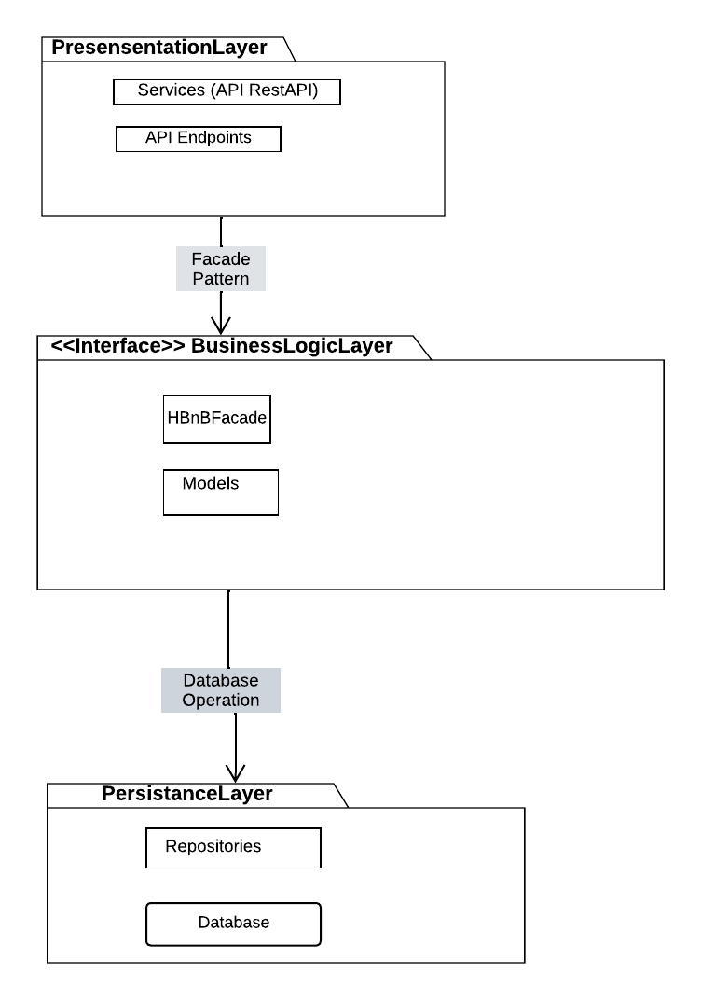
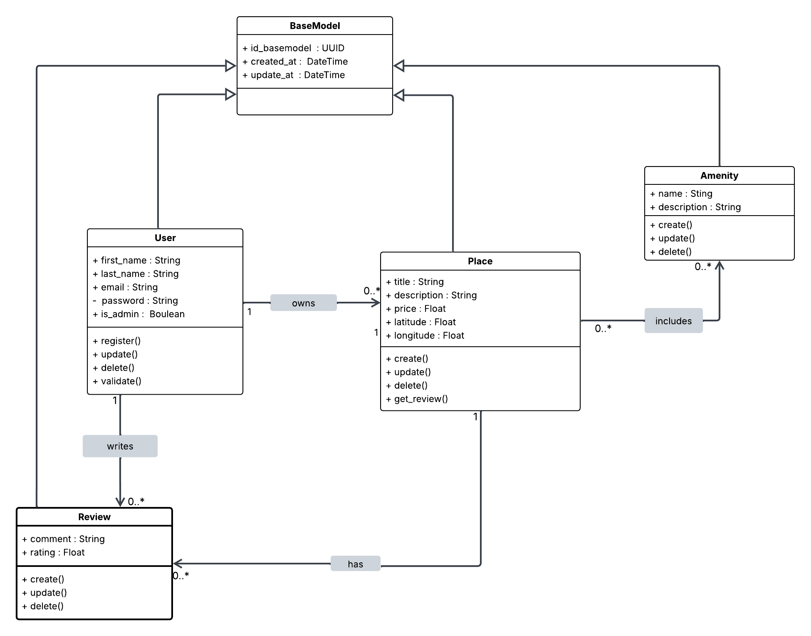
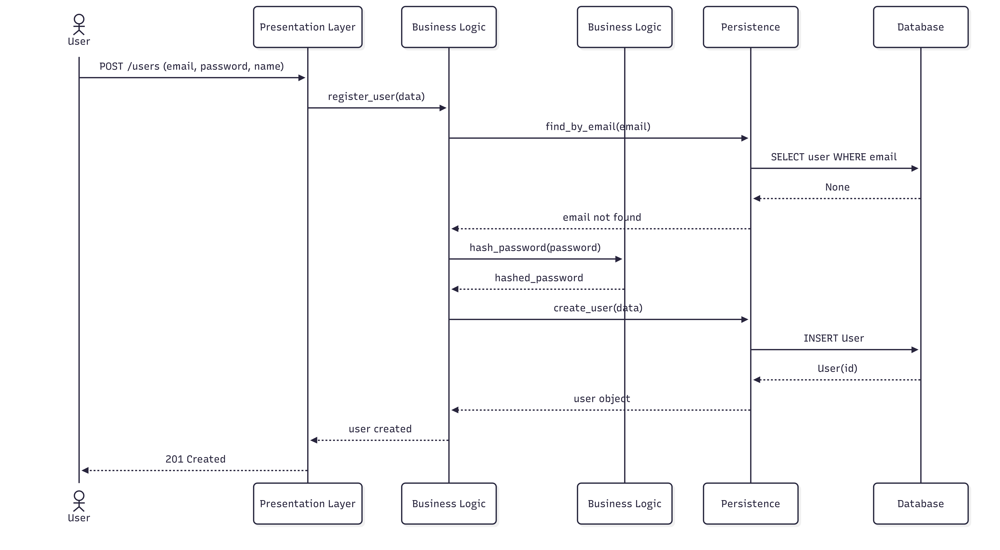
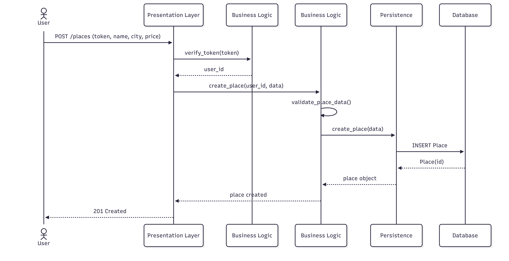
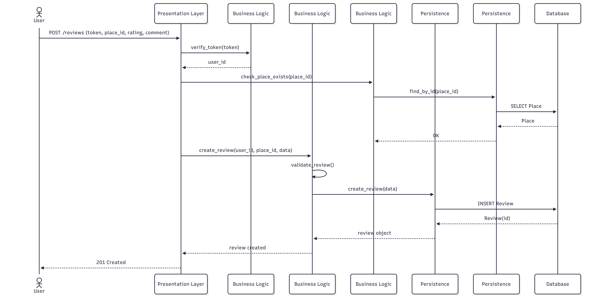
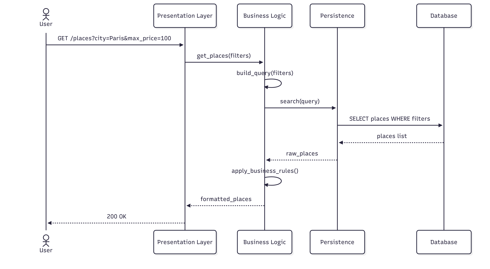

# HBnB – UML Technical Documentation

## Project Overview

HBnB is a backend housing rental application inspired by Airbnb.  
It allows users to:
- create an account,
- publish properties,
- browse available properties,
- leave reviews,
- manage amenities associated with properties.

This repository contains the **UML technical documentation** of the project.  
It describes the architecture, business entities, and API interaction flows.

---

## Documentation Objectives

The purpose of this documentation is to:
- clearly explain the project architecture,
- describe the responsibilities of each layer,
- present the main entities and their relationships,
- illustrate how the API works through sequence diagrams.

It is intended for:
- developers,
- software architects,
- testers,
- project maintainers.

---

## Overall Architecture

The HBnB project uses a **three-layer architecture**.  
Each layer has a specific role and communicates only with its neighboring layer.

### Presentation Layer

The presentation layer is the **entry point of the application**.

Responsibilities:
- receiving HTTP requests from clients,
- validating basic data (formats, required fields),
- calling the appropriate business logic,
- returning an HTTP response to the client.

Main components:
- REST endpoints (`/users`, `/places`, `/reviews`, `/amenities`)
- controllers

This layer contains **no complex business logic**.

---

### Business Logic Layer

The business logic layer contains the **intelligence of the application**.

Responsibilities:
- applying business rules,
- checking data consistency,
- coordinating operations between presentation and persistence layers.

It uses the **Facade pattern** through a central interface:
- `HBnBFacade`

Examples of business rules:
- a user email must be unique,
- a user cannot leave two reviews for the same property,
- a property price must be positive.

This layer decides **what to do** and **how to do it**.

---

### Persistence Layer

The persistence layer is responsible for **data management**.

It contains:
- repositories (`UserRepository`, `PlaceRepository`, etc.),
- database access logic,
- CRUD operations (Create, Read, Update, Delete).

Responsibilities:
- storing business objects,
- retrieving data from the database,
- updating or deleting records.

The business logic layer **never communicates directly** with the database.

---

## Design Pattern Used

### Facade Pattern

The **Facade Pattern** is used to:
- simplify communication between layers,
- reduce coupling,
- provide a single interface to the presentation layer.

The presentation layer interacts only with the **Facade**, without knowing the
internal details of the business logic.

---

## UML Diagrams

### Package Diagram (Task 0)

This diagram shows:
- the three architectural layers,
- the direction of data flow,
- the central position of the Facade.

---

### Class Diagram (Task 1)

#### Main Entities

##### User
Attributes:
- id
- email
- password
- first_name
- last_name

Responsibilities:
- user profile management,
- authentication,
- publishing reviews.

---

##### Place
Attributes:
- id
- owner_id
- name
- description
- price
- location

Responsibilities:
- managing property information,
- associating amenities,
- receiving reviews.

---

##### Review
Attributes:
- id
- place_id
- user_id
- rating
- comment

Responsibilities:
- creating and managing reviews,
- contributing to a property’s average rating.

---

##### Amenity
Attributes:
- id
- name
- description

Responsibilities:
- managing the amenities catalog,
- associating amenities with properties.

---

#### Entity Relationships

- A **User** can own multiple **Place** entities (1:N)
- A **Place** can have multiple **Review** entities (1:N)
- A **User** can write multiple **Review** entities (1:N)
- A **Place** can have multiple **Amenity** entities (N:N via a junction table)

---

## Sequence Diagrams (Task 2)

### User Creation

1. POST `/users`
2. Data validation
3. Business rules application
4. Email uniqueness check
5. Database persistence
6. HTTP response `201 Created`

---

### Property Creation

1. POST `/places`
2. User verification
3. Business validation
4. Property persistence
5. Amenities association
6. HTTP response `201 Created`

---

### Review Creation

1. POST `/reviews`
2. User and property verification
3. Business validation
4. Review persistence
5. Average rating update
6. HTTP response `201 Created`

---

### Property Retrieval

1. GET `/places`
2. Filter validation
3. Business rules application
4. Paginated retrieval
5. HTTP response `200 OK`

---

## Technical Qualities

- Clear separation of responsibilities
- Modular and maintainable architecture
- Easy unit testing
- Scalable system design
- Backend best practices compliance

---

## Authors

- **James Roussel**
- **Tommy Jouhans**

---

## Academic Project

HBnB – Holberton School  
UML Technical Documentation

[HBNB UML Task 3](UML/task3.pdf)

---

## Tools Used

### Diagrams
- **Lucid** – https://lucid.app/documents/
- **Mermaid** – https://mermaid.live/

### Documentation
- **Gamma.app** – https://gamma.app/
- **See the online documentation**:
 - https://gamma.app/docs/HBnB-UML-Technical-Documentation-gyee6k4t82ctpm0
 - https://hbnb-uml-technical-docum-uihii9o.gamma.site/
 