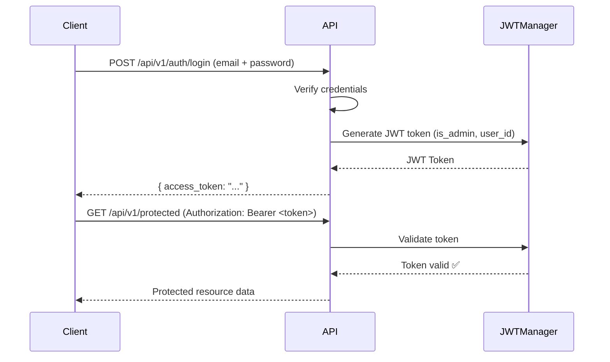
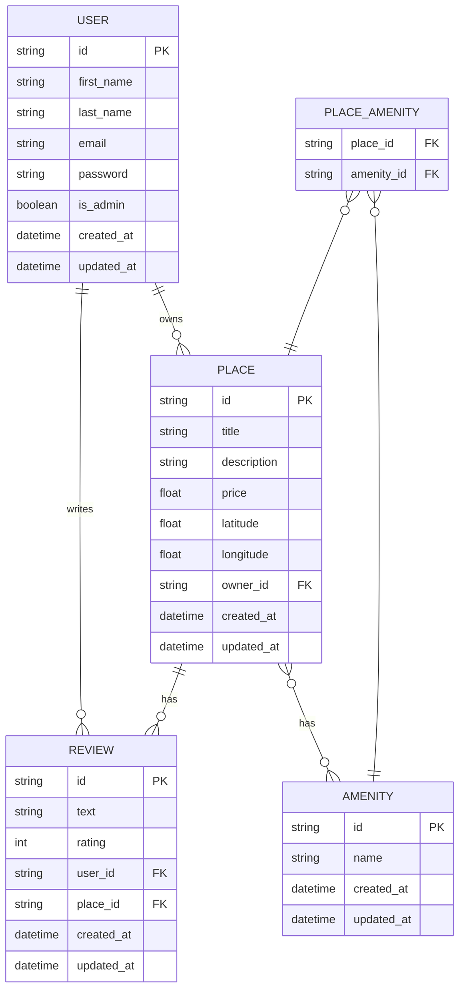
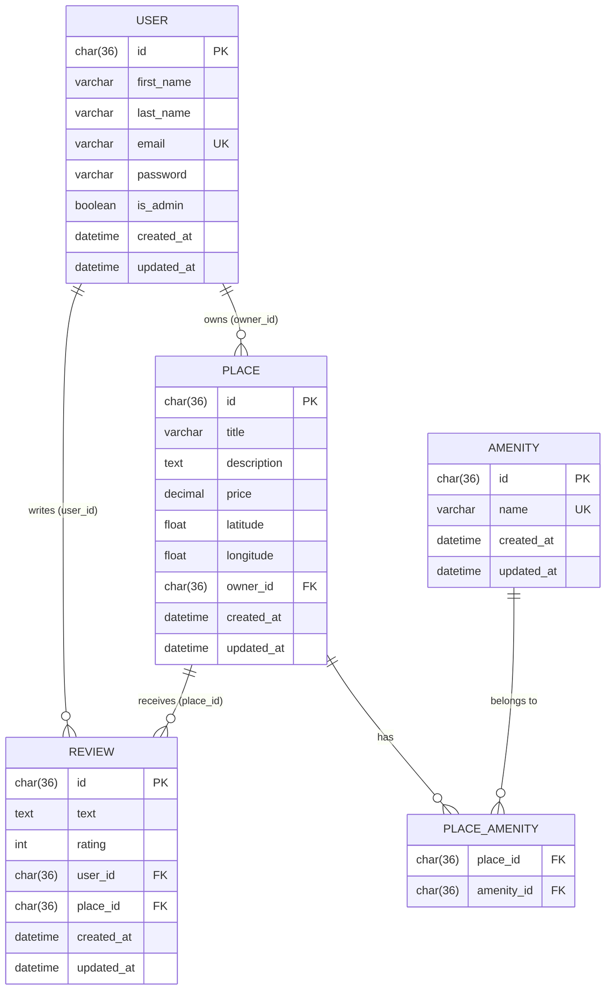

# HBnb Part 3 :Part 3: Enhanced Backend with Authentication and Database Integration
### Authors: Tommy Jouhans & James Roussel
---

## Table of Contents

- [Project Overview](#project-overview)
- [Project Structure](#project-structure)
- [Task 0 - Application Factory Configuration](#task-0---application-factory-configuration)
- [Task 1 - Password Hashing with bcrypt](#task-1---password-hashing-with-bcrypt)
- [Task 2 - JWT Authentication](#task-2---jwt-authentication)
- [Task 3 - SQLAlchemy Repository](#task-3---sqlalchemy-repository)
- [Task 4 - Map User Entity](#task-4---map-user-entity)
- [Task 5 - Map Place, Review, Amenity Entities](#task-5---map-place-review-and-amenity-entities)
- [Task 6 - Map Relationships Between Entities](#task-6---map-relationships-between-entities)
- [Task 7 - Authenticated User Access](#task-7---authenticated-user-access)
- [Task 8 - Administrator Access](#task-8---administrator-access)
- [Task 9 - SQL Scripts](#task-9---sql-scripts)
- [Task 10 - ER Diagram](#task-10---er-diagram)
- [Setup & Installation](#setup--installation)
- [Running the Application](#running-the-application)

---

## Project Overview

HBnB Part 3 extends the REST API built in previous parts by introducing:
- **SQLAlchemy** for database persistence (replacing in-memory storage)
- **JWT authentication** via `flask-jwt-extended`
- **bcrypt password hashing** via `flask-bcrypt`
- **Role-based access control** (admin vs regular users)
- **Full relational database** schema with one-to-many and many-to-many relationships

---

## Project Structure

```
part3/
├── hbnb/
│   ├── app/
│   │   ├── __init__.py          # Application factory
│   │   ├── config.py            # Configuration classes
│   │   ├── utils.py             # Password hashing utilities
│   │   ├── api/
│   │   │   └── v1/
│   │   │       ├── auth.py      # JWT login endpoint
│   │   │       ├── users.py     # User endpoints
│   │   │       ├── places.py    # Place endpoints
│   │   │       ├── reviews.py   # Review endpoints
│   │   │       └── amenities.py # Amenity endpoints
│   │   ├── models/
│   │   │   ├── base_model.py    # SQLAlchemy BaseModel
│   │   │   ├── user.py          # User model
│   │   │   ├── place.py         # Place model
│   │   │   ├── review.py        # Review model
│   │   │   ├── amenity.py       # Amenity model
│   │   │   └── place_amenity.py # Association table
│   │   ├── persistence/
│   │   │   └── repository.py    # InMemory & SQLAlchemy repositories
│   │   └── services/
│   │       └── facade.py        # Business logic facade
│   └── run.py                   # Entry point
├── instance/
│   └── development.db           # SQLite database
└── README.md
```

---

## Task 0 - Application Factory Configuration

**Objective:** Update the Flask Application Factory to accept a configuration object.

The `create_app()` function in `app/__init__.py` receives a configuration class and applies it to the Flask instance.

```python
# hbnb/app/config.py
import os

class Config:
    SECRET_KEY = os.getenv('SECRET_KEY', 'dev-secret-key-change-in-production')
    JWT_SECRET_KEY = os.getenv('JWT_SECRET_KEY', 'jwt-secret-key-change-in-production')
    DEBUG = False
    SQLALCHEMY_TRACK_MODIFICATIONS = False

class DevelopmentConfig(Config):
    DEBUG = True
    SQLALCHEMY_DATABASE_URI = 'sqlite:///development.db'

class ProductionConfig(Config):
    DEBUG = False
    SQLALCHEMY_DATABASE_URI = os.getenv('DATABASE_URL', 'sqlite:///production.db')
```

```python
# hbnb/app/__init__.py
def create_app(config_class=None):
    if config_class is None:
        config_class = DevelopmentConfig
    app = Flask(__name__)
    app.config.from_object(config_class)
    # ...
    return app
```

```python
# hbnb/run.py
from hbnb.app import create_app
from hbnb.app.config import DevelopmentConfig

app = create_app(DevelopmentConfig)

if __name__ == '__main__':
    app.run(debug=True)
```

---

## Task 1 - Password Hashing with bcrypt

**Objective:** Securely hash and store user passwords using bcrypt.

### Installation

```bash
pip install flask-bcrypt
```

### Implementation

```python
# app/__init__.py
from flask_bcrypt import Bcrypt
bcrypt = Bcrypt()

def create_app(config_class=None):
    # ...
    bcrypt.init_app(app)
```

```python
# models/user.py
def hash_password(self, password):
    self.password = bcrypt.generate_password_hash(password).decode('utf-8')

def verify_password(self, password):
    return bcrypt.check_password_hash(self.password, password)
```

### Test - Create User (password hashed, not returned)

```bash
curl -X POST "http://127.0.0.1:5000/api/v1/users/" \
  -H "Content-Type: application/json" \
  -d '{"first_name": "John", "last_name": "Doe", "email": "john@example.com", "password": "pass123"}'
```

**Expected Response:**
```json
{
    "id": "3597e65d-068e-43ae-8229-b011d4cb532e",
    "message": "User successfully created"
}
```

### Test - Get User (password not exposed)

```bash
curl -X GET "http://127.0.0.1:5000/api/v1/users/3597e65d-068e-43ae-8229-b011d4cb532e"
```

**Expected Response:**
```json
{
    "id": "3597e65d-068e-43ae-8229-b011d4cb532e",
    "first_name": "John",
    "last_name": "Doe",
    "email": "john@example.com",
    "is_admin": false
}
```

---

## Task 2 - JWT Authentication

**Objective:** Implement JWT-based login using `flask-jwt-extended`.

### JWT Flow Diagram



### Installation

```bash
pip install flask-jwt-extended
```

### Implementation

```python
# app/__init__.py
from flask_jwt_extended import JWTManager
jwt = JWTManager()

def create_app(config_class=None):
    # ...
    jwt.init_app(app)
```

### Test - Login

```bash
curl -X POST "http://127.0.0.1:5000/api/v1/auth/login" \
  -H "Content-Type: application/json" \
  -d '{"email": "admin@example.com", "password": "admin123"}'
```

**Expected Response:**
```json
{
    "access_token": "eyJhbGciOiJIUzI1NiIsInR5cCI6IkpXVCJ9..."
}
```

### Test - Access Protected Endpoint

```bash
curl -X GET "http://127.0.0.1:5000/api/v1/users/" \
  -H "Authorization: Bearer <your_token>"
```

### Test - Invalid / Expired Token

```json
{
    "msg": "Token has expired"
}
```

---

## Task 3 - SQLAlchemy Repository

**Objective:** Replace the in-memory repository with a SQLAlchemy-based repository.

### Switch between repositories

```bash
# Use SQLAlchemy (recommended)
export USE_DATABASE=true && python -m hbnb.run

# Use InMemory (default)
python -m hbnb.run
```

### Repository Interface

```python
# persistence/repository.py
class SQLAlchemyRepository(Repository):
    def __init__(self, model):
        self.model = model

    def add(self, obj):
        from hbnb.app import db
        db.session.add(obj)
        db.session.commit()

    def get(self, obj_id):
        from hbnb.app import db
        return db.session.get(self.model, obj_id)

    def get_all(self):
        return self.model.query.all()

    def update(self, obj_id, data):
        from hbnb.app import db
        obj = self.get(obj_id)
        if obj:
            for key, value in data.items():
                setattr(obj, key, value)
            db.session.commit()
            return obj
        return None

    def delete(self, obj_id):
        from hbnb.app import db
        obj = self.get(obj_id)
        if obj:
            db.session.delete(obj)
            db.session.commit()

    def get_by_attribute(self, attr_name, attr_value):
        return self.model.query.filter_by(**{attr_name: attr_value}).first()
```

### Facade Selection Logic

```python
# services/facade.py
USE_DATABASE = os.getenv('USE_DATABASE', 'false').lower() == 'true'

if USE_DATABASE:
    print("Using SQLAlchemy Repository")
else:
    print("Using InMemory Repository")
```

---

## Task 4 - Map User Entity

**Objective:** Map the User entity to a SQLAlchemy model.

### BaseModel

```python
# models/base_model.py
from hbnb.app import db
import uuid
from datetime import datetime

class BaseModel(db.Model):
    __abstract__ = True

    id = db.Column(db.String(36), primary_key=True, default=lambda: str(uuid.uuid4()))
    created_at = db.Column(db.DateTime, default=datetime.utcnow, nullable=False)
    updated_at = db.Column(db.DateTime, default=datetime.utcnow, onupdate=datetime.utcnow, nullable=False)
```

### User Model

```python
# models/user.py
class User(BaseModel, db.Model):
    __tablename__ = "users"

    first_name = db.Column(db.String(50), nullable=False)
    last_name  = db.Column(db.String(50), nullable=False)
    email      = db.Column(db.String(120), unique=True, nullable=False, index=True)
    password   = db.Column(db.String(255), nullable=False)
    is_admin   = db.Column(db.Boolean, default=False)
```

### Initialize Database

```bash
export USE_DATABASE=true
export FLASK_APP=hbnb.app
flask shell
>>> from hbnb.app import db
>>> from hbnb.app.models import User, Place, Review, Amenity
>>> db.create_all()
>>> exit()
```

### Test - Create User

```bash
curl -X POST "http://127.0.0.1:5000/api/v1/users/" \
  -H "Content-Type: application/json" \
  -H "Authorization: Bearer <admin_token>" \
  -d '{"first_name": "John", "last_name": "Doe", "email": "john@test.com", "password": "pass123"}'
```

**Expected Response:**
```json
{
    "id": "3597e65d-068e-43ae-8229-b011d4cb532e",
    "message": "User successfully created"
}
```

---

## Task 5 - Map Place, Review, and Amenity Entities

**Objective:** Map the remaining entities to SQLAlchemy models.

### Place Model

```python
class Place(BaseModel, db.Model):
    __tablename__ = 'places'

    title           = db.Column(db.String(100), nullable=False)
    description     = db.Column(db.Text, nullable=True)
    price           = db.Column(db.Float, nullable=False)
    latitude        = db.Column(db.Float, nullable=False)
    longitude       = db.Column(db.Float, nullable=False)
    number_rooms    = db.Column(db.Integer, default=0)
    number_bathrooms= db.Column(db.Integer, default=0)
    max_guest       = db.Column(db.Integer, default=0)
```

### Review Model

```python
class Review(BaseModel, db.Model):
    __tablename__ = 'reviews'

    text   = db.Column(db.Text, nullable=False)
    rating = db.Column(db.Integer, nullable=False)
```

### Amenity Model

```python
class Amenity(BaseModel, db.Model):
    __tablename__ = 'amenities'

    name = db.Column(db.String(100), nullable=False, unique=True)
```

### Test - Create Place

```bash
curl -X POST "http://127.0.0.1:5000/api/v1/places/" \
  -H "Content-Type: application/json" \
  -H "Authorization: Bearer <token>" \
  -d '{"title": "Maison de John", "description": "Belle vue sur la mer", "price": 80, "latitude": 43.3, "longitude": 5.4}'
```

**Expected Response:**
```json
{
    "id": "86b561aa-b69a-4b8e-974b-b1b508e8aa35",
    "title": "Maison de John",
    "description": "Belle vue sur la mer",
    "price": 80.0,
    "latitude": 43.3,
    "longitude": 5.4,
    "owner_id": "3597e65d-068e-43ae-8229-b011d4cb532e"
}
```

### Test - Create Amenity

```bash
curl -X POST "http://127.0.0.1:5000/api/v1/amenities/" \
  -H "Content-Type: application/json" \
  -H "Authorization: Bearer <token>" \
  -d '{"name": "WiFi"}'
```

**Expected Response:**
```json
{
    "id": "168750ed-bb58-4b67-973a-ad0c1a548682",
    "name": "WiFi",
    "created_at": "2026-03-09T14:50:00.951063",
    "updated_at": "2026-03-09T14:50:00.951070"
}
```

### Test - Add Amenity in place

```bash
curl -X POST "http://127.0.0.1:5000/api/v1/amenities/" \
  -H "Content-Type: application/json" \
  -H "Authorization: Bearer <token>" \
  -d '{"name": "WiFi"}'
```

**Expected Response:**
```json
{
    "message": "Amenity added to place successfully"
}
```
---

## Task 6 - Map Relationships Between Entities

**Objective:** Define one-to-many and many-to-many relationships using SQLAlchemy.

### Relationships Diagram



**Relationship ER diagram** 


### Implementation

```python
# models/__init__.py
place_amenity = db.Table(
    'place_amenity',
    db.Column('place_id', db.String(36), db.ForeignKey('places.id', ondelete='CASCADE'), primary_key=True),
    db.Column('amenity_id', db.String(36), db.ForeignKey('amenities.id', ondelete='CASCADE'), primary_key=True)
)
```

```python
# In User model
places  = db.relationship('Place', back_populates='owner', cascade='all, delete-orphan')
reviews = db.relationship('Review', back_populates='user', cascade='all, delete-orphan')

# In Place model
owner_id = db.Column(db.String(36), db.ForeignKey('users.id'), nullable=False)
owner    = db.relationship('User', back_populates='places')
reviews  = db.relationship('Review', back_populates='place', cascade='all, delete-orphan')
amenities = db.relationship('Amenity', secondary='place_amenity', back_populates='places')

# In Review model
user_id  = db.Column(db.String(36), db.ForeignKey('users.id'), nullable=False)
place_id = db.Column(db.String(36), db.ForeignKey('places.id'), nullable=False)
```

### Test - Link Amenity to Place

```bash
curl -X POST "http://127.0.0.1:5000/api/v1/places/86b561aa-b69a-4b8e-974b-b1b508e8aa35/amenities/168750ed-bb58-4b67-973a-ad0c1a548682" \
  -H "Authorization: Bearer <token>"
```

**Expected Response:**
```json
{
    "message": "Amenity added to place successfully"
}
```

### Test - Get Place Amenities

```bash
curl -X GET "http://127.0.0.1:5000/api/v1/places/86b561aa-b69a-4b8e-974b-b1b508e8aa35/amenities" \
  -H "Authorization: Bearer <token>"
```

**Expected Response:**
```json
[
    {
        "id": "168750ed-bb58-4b67-973a-ad0c1a548682",
        "name": "WiFi",
        "created_at": "2026-03-09T14:50:00.951063",
        "updated_at": "2026-03-09T14:50:00.951070"
    }
]
```

### Test - Create Review (different user)

```bash
curl -X POST "http://127.0.0.1:5000/api/v1/reviews/" \
  -H "Content-Type: application/json" \
  -H "Authorization: Bearer <admin_token>" \
  -d '{"text": "Excellent séjour!", "rating": 5, "place_id": "86b561aa-b69a-4b8e-974b-b1b508e8aa35", "user_id": "3debbf35-bbd2-4bc0-acfc-d3c1962aedb3"}'
```

**Expected Response:**
```json
{
    "id": "7d5a9f01-f662-4d30-9d63-97c6e775d612",
    "text": "Excellent séjour!",
    "rating": 5,
    "user_id": "3debbf35-bbd2-4bc0-acfc-d3c1962aedb3",
    "place_id": "86b561aa-b69a-4b8e-974b-b1b508e8aa35"
}
```

### Test - Get Place Reviews

```bash
curl -X GET "http://127.0.0.1:5000/api/v1/places/86b561aa-b69a-4b8e-974b-b1b508e8aa35/reviews" \
  -H "Authorization: Bearer <token>"
```

**Expected Response:**
```json
[
    {
        "id": "7d5a9f01-f662-4d30-9d63-97c6e775d612",
        "text": "Excellent séjour!",
        "rating": 5,
        "user_id": "3debbf35-bbd2-4bc0-acfc-d3c1962aedb3",
        "place_id": "86b561aa-b69a-4b8e-974b-b1b508e8aa35"
    }
]
```

### Test - Cannot Review Own Place (Business Rule)

```bash
curl -X POST "http://127.0.0.1:5000/api/v1/reviews/" \
  -H "Content-Type: application/json" \
  -H "Authorization: Bearer <john_token>" \
  -d '{"text": "My own place!", "rating": 5, "place_id": "86b561aa-b69a-4b8e-974b-b1b508e8aa35", "user_id": "3597e65d-068e-43ae-8229-b011d4cb532e"}'
```

**Expected Response:**
```json
{
    "error": "You cannot review your own place"
}
```

---

## Task 7 - Authenticated User Access

**Objective:** Secure endpoints with JWT, add ownership validation.

### Protected Endpoints

| Method | Endpoint | Description |
|--------|----------|-------------|
| POST | `/api/v1/places/` | Create a place (authenticated) |
| PUT | `/api/v1/places/<id>` | Update own place only |
| POST | `/api/v1/reviews/` | Create review (not own place, once per place) |
| PUT | `/api/v1/reviews/<id>` | Update own review only |
| DELETE | `/api/v1/reviews/<id>` | Delete own review only |
| PUT | `/api/v1/users/<id>` | Update own profile (no email/password) |

### Public Endpoints

| Method | Endpoint | Description |
|--------|----------|-------------|
| GET | `/api/v1/places/` | List all places |
| GET | `/api/v1/places/<id>` | Get place details |

### Test - Unauthorized Place Update

```bash
curl -X PUT "http://127.0.0.1:5000/api/v1/places/86b561aa-b69a-4b8e-974b-b1b508e8aa35" \
  -H "Content-Type: application/json" \
  -H "Authorization: Bearer <other_user_token>" \
  -d '{"title": "Hacked title"}'
```

**Expected Response:**
```json
{
    "error": "Unauthorized action"
}
```

### Test - Update Own Review

```bash
curl -X PUT "http://127.0.0.1:5000/api/v1/reviews/7d5a9f01-f662-4d30-9d63-97c6e775d612" \
  -H "Content-Type: application/json" \
  -H "Authorization: Bearer <admin_token>" \
  -d '{"text": "Updated review", "rating": 4}'
```

### Test - Public Places (no token needed)

```bash
curl -X GET "http://127.0.0.1:5000/api/v1/places/"
```

**Expected Response:**
```json
[
    {
        "id": "86b561aa-b69a-4b8e-974b-b1b508e8aa35",
        "title": "Maison de John",
        "price": 80.0
    }
]
```

### Test - Modify Own User Info (no email/password)

```bash
curl -X PUT "http://127.0.0.1:5000/api/v1/users/3597e65d-068e-43ae-8229-b011d4cb532e" \
  -H "Content-Type: application/json" \
  -H "Authorization: Bearer <john_token>" \
  -d '{"first_name": "Johnny"}'
```

### Test - Try to Modify Email (blocked)

```bash
curl -X PUT "http://127.0.0.1:5000/api/v1/users/3597e65d-068e-43ae-8229-b011d4cb532e" \
  -H "Content-Type: application/json" \
  -H "Authorization: Bearer <john_token>" \
  -d '{"email": "newemail@test.com"}'
```

**Expected Response:**
```json
{
    "error": "You cannot modify email or password"
}
```

---

## Task 8 - Administrator Access

**Objective:** Allow admins to bypass ownership restrictions and manage all resources.

### Admin-Only Endpoints

| Method | Endpoint | Description |
|--------|----------|-------------|
| POST | `/api/v1/users/` | Create any user |
| PUT | `/api/v1/users/<id>` | Modify any user (incl. email/password) |
| POST | `/api/v1/amenities/` | Create amenity |
| PUT | `/api/v1/amenities/<id>` | Modify amenity |

### RBAC Check Pattern

```python
from flask_jwt_extended import get_jwt

@api.route('/<amenity_id>')
class AmenityResource(Resource):
    @jwt_required()
    def put(self, amenity_id):
        current_user = get_jwt()
        if not current_user.get('is_admin'):
            return {'error': 'Admin privileges required'}, 403
        # update logic...
```

### Test - Create User as Admin

```bash
curl -X POST "http://127.0.0.1:5000/api/v1/users/" \
  -H "Content-Type: application/json" \
  -H "Authorization: Bearer <admin_token>" \
  -d '{"first_name": "Jane", "last_name": "Smith", "email": "jane@test.com", "password": "pass123"}'
```

### Test - Add Amenity as Admin

```bash
curl -X POST "http://127.0.0.1:5000/api/v1/amenities/" \
  -H "Content-Type: application/json" \
  -H "Authorization: Bearer <admin_token>" \
  -d '{"name": "Swimming Pool"}'
```

### Test - Non-admin Tries to Create Amenity

```bash
curl -X POST "http://127.0.0.1:5000/api/v1/amenities/" \
  -H "Content-Type: application/json" \
  -H "Authorization: Bearer <john_token>" \
  -d '{"name": "Sauna"}'
```

**Expected Response:**
```json
{
    "error": "Admin privileges required"
}
```

### Test - Admin Modifies Another User's Place

```bash
curl -X PUT "http://127.0.0.1:5000/api/v1/places/86b561aa-b69a-4b8e-974b-b1b508e8aa35" \
  -H "Content-Type: application/json" \
  -H "Authorization: Bearer <admin_token>" \
  -d '{"title": "Admin Updated Title"}'
```

---

## Task 9 - SQL Scripts

**Objective:** Generate SQL scripts for table creation and initial data.

### Table Creation

```sql
-- Users table
CREATE TABLE IF NOT EXISTS users (
    id CHAR(36) PRIMARY KEY,
    first_name VARCHAR(255) NOT NULL,
    last_name VARCHAR(255) NOT NULL,
    email VARCHAR(255) UNIQUE NOT NULL,
    password VARCHAR(255) NOT NULL,
    is_admin BOOLEAN DEFAULT FALSE,
    created_at DATETIME DEFAULT CURRENT_TIMESTAMP,
    updated_at DATETIME DEFAULT CURRENT_TIMESTAMP
);

-- Places table
CREATE TABLE IF NOT EXISTS places (
    id CHAR(36) PRIMARY KEY,
    title VARCHAR(255) NOT NULL,
    description TEXT,
    price DECIMAL(10,2) NOT NULL,
    latitude FLOAT NOT NULL,
    longitude FLOAT NOT NULL,
    owner_id CHAR(36) NOT NULL,
    created_at DATETIME DEFAULT CURRENT_TIMESTAMP,
    updated_at DATETIME DEFAULT CURRENT_TIMESTAMP,
    FOREIGN KEY (owner_id) REFERENCES users(id) ON DELETE CASCADE
);

-- Reviews table
CREATE TABLE IF NOT EXISTS reviews (
    id CHAR(36) PRIMARY KEY,
    text TEXT NOT NULL,
    rating INT CHECK (rating BETWEEN 1 AND 5),
    user_id CHAR(36) NOT NULL,
    place_id CHAR(36) NOT NULL,
    created_at DATETIME DEFAULT CURRENT_TIMESTAMP,
    updated_at DATETIME DEFAULT CURRENT_TIMESTAMP,
    FOREIGN KEY (user_id) REFERENCES users(id) ON DELETE CASCADE,
    FOREIGN KEY (place_id) REFERENCES places(id) ON DELETE CASCADE,
    UNIQUE (user_id, place_id)
);

-- Amenities table
CREATE TABLE IF NOT EXISTS amenities (
    id CHAR(36) PRIMARY KEY,
    name VARCHAR(255) UNIQUE NOT NULL,
    created_at DATETIME DEFAULT CURRENT_TIMESTAMP,
    updated_at DATETIME DEFAULT CURRENT_TIMESTAMP
);

-- Place_Amenity association table
CREATE TABLE IF NOT EXISTS place_amenity (
    place_id CHAR(36) NOT NULL,
    amenity_id CHAR(36) NOT NULL,
    PRIMARY KEY (place_id, amenity_id),
    FOREIGN KEY (place_id) REFERENCES places(id) ON DELETE CASCADE,
    FOREIGN KEY (amenity_id) REFERENCES amenities(id) ON DELETE CASCADE
);
```

### Initial Data

```sql
-- Admin user (password: admin1234 hashed with bcrypt)
INSERT INTO users (id, first_name, last_name, email, password, is_admin)
VALUES (
    '36c9050e-ddd3-4c3b-9731-9f487208bbc1',
    'Admin',
    'HBnB',
    'admin@hbnb.io',
    '$2b$12$...hashed_password...',
    TRUE
);

-- Initial Amenities
INSERT INTO amenities (id, name) VALUES
    (uuid(), 'WiFi'),
    (uuid(), 'Swimming Pool'),
    (uuid(), 'Air Conditioning');
```

---

## Task 10 - ER Diagram

**Objective:** Visual representation of the full database schema.


**ER diagram generated:**


---

## Setup & Installation

### Prerequisites

- Python 3.8+
- pip
- virtualenv (recommended)

### Install Dependencies

```bash
cd part3
python -m venv venv
source venv/bin/activate  # Linux/Mac
# or venv\Scripts\activate on Windows

pip install -r requirements.txt
```

### requirements.txt

```
flask
flask-restx
flask-sqlalchemy
flask-jwt-extended
flask-bcrypt
sqlalchemy
```

---

## Running the Application

### InMemory mode (default)

```bash
python -m hbnb.run
```

### SQLAlchemy mode (recommended)

```bash
export USE_DATABASE=true
python -m hbnb.run
```

**Expected startup output:**
```
Using SQLAlchemy Repository
✅ Admin user initialized with ID: <uuid>
 * Serving Flask app 'hbnb.app'
 * Running on http://127.0.0.1:5000
```

### Quick test workflow

```bash
# 1. Login as admin
TOKEN=$(curl -s -X POST http://127.0.0.1:5000/api/v1/auth/login \
  -H "Content-Type: application/json" \
  -d '{"email":"admin@example.com","password":"admin123"}' | python3 -c "import sys,json; print(json.load(sys.stdin)['access_token'])")

# 2. Create a user
curl -X POST http://127.0.0.1:5000/api/v1/users/ \
  -H "Content-Type: application/json" \
  -H "Authorization: Bearer $TOKEN" \
  -d '{"first_name":"John","last_name":"Doe","email":"john@test.com","password":"pass123"}'

# 3. List all places (public)
curl http://127.0.0.1:5000/api/v1/places/


# 4. List tables in database:

sqlite3 instance/development.db ".tables"


# 5. To print the content of each table:
sqlite3 instance/development.db "SELECT * FROM users;"
sqlite3 instance/development.db "SELECT * FROM places;"
sqlite3 instance/development.db "SELECT * FROM amenities;"
sqlite3 instance/development.db "SELECT * FROM reviews;"
sqlite3 instance/development.db "SELECT * FROM place_amenity;"

```


---
## Authors

- Tommy Jouhans

- James Roussel

---
